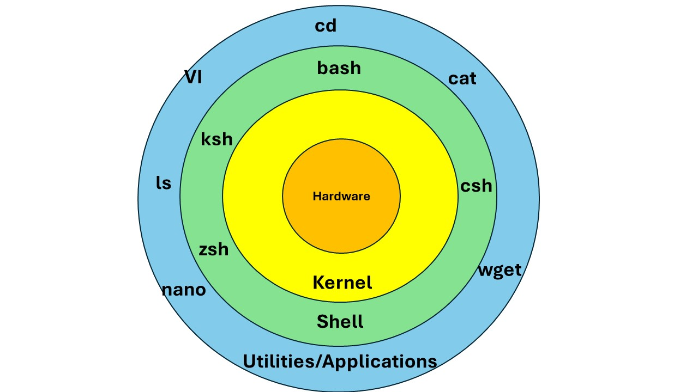

# Bash Scripting 
## What is UNIX ?
Unix is a powerful, multiuser, multitasking operating system (OS) that was developed in the early 1970s at AT&T's Bell Labs by Ken Thompson, Dennis Ritchie, and others. Unix is designed to be portable, flexible, and easy to adapt and use for various types of hardware and computing environments.
### Key Characteristics of Unix:
- Multiuser: Unix allows multiple users to work on the same system simultaneously without interfering with each other.
- Multitasking: It can run multiple tasks (processes) concurrently, making it highly efficient for both single-user and multi-user environments.
- Portability: Unix was one of the first OSs to be written in the C programming language, which made it easier to modify and port (adapt) to different hardware platforms.
- Modular Design: Unix has a simple and modular design, with small programs that do specific tasks well. These programs can be combined in scripts to perform complex operations.
- File-Based: Everything in Unix is treated as a file, including devices like printers, hard drives, and even network connections, which makes the system consistent and easier to manage.
- Security and Permissions: Unix has a robust system of file permissions (read, write, execute) and user/group management to ensure security.

## What is Linux?
Linux is an open-source operating system (OS) that is based on the Unix OS. It is widely used for servers, desktop computers, and embedded devices due to its robustness, flexibility, and security.
- Kernel: At the core of Linux is the kernel—the program that directly interacts with the computer's hardware (CPU, memory, disk, etc.). The kernel manages system resources and communication between hardware and software.
- Distributions (Distros): Linux comes in many distributions (e.g., Ubuntu, CentOS, Debian, Fedora) that bundle the kernel with other software like the shell, graphical interface, and application packages.

### What is a Shell?
A shell is a command-line interface (CLI) that allows you to interact with the operating system by typing commands. Think of it as a bridge between you and the operating system's kernel. There are several types of shells, but Bash (Bourne Again SHell) is the most commonly used shell in Linux.
- Command Execution: The shell takes the commands you type, interprets them, and then communicates with the operating system to execute those commands.
- Scripting: Shells also allow you to write scripts—sequences of commands saved in a file—that automate tasks.

### Overview of the Linux File System
Hierarchical Structure: The Linux file system is organized in a tree-like hierarchy, starting from the root directory, represented by a forward slash (/), with all other files and directories branching off from it.
- Everything is a File: In Linux, everything is treated as a file, including hardware devices, processes, and configuration files.
- Unified File System: All storage devices are mounted under a single directory structure, rather than having separate drives like C:\ or D:\ in Windows.

#### Key Directories in the Linux File System
Let's explore the most important directories found in the Linux file system:
1. / (Root Directory)
    - The root directory is the top-level directory of the Linux file system hierarchy. All other files and directories are contained within it.
    - Only the root user (the administrative user) has full access to all parts of the root directory.
2. /bin (Binary Executables)
    - Contains essential user command binaries (executables) needed for basic system operations, available for all users.
    - Examples: ls, cp, mv, rm, bash, etc.
3. /boot (Boot Loader Files)
    - Contains files needed for booting the system, including the kernel, initial RAM disk image (initrd), and bootloader configurations (e.g., GRUB).
    - Example files: vmlinuz (compressed Linux kernel), initrd.img.
4. /dev (Device Files)
    - Contains special device files that represent hardware components (like hard disks, USB drives, terminals).
    - These are not actual files but references that provide an interface to the kernel’s device drivers.
    - Examples: /dev/sda (first SATA hard disk), /dev/tty (terminal devices).
5. /etc (Configuration Files)
    - Contains system-wide configuration files and shell scripts used to control system startup and services.
    - These files are usually plain text and can be edited by the root user to configure system behavior.
    - Examples: /etc/fstab (file system mount configuration), /etc/passwd (user account information).
6. /home (User Home Directories)
    - Contains the home directories of all regular (non-root) users on the system.
    - Each user has a subdirectory under /home named after their username.
    - Example: /home/username where username is the name of a user.
7. /lib (Shared Libraries)
    - Contains shared libraries required by system binaries located in /bin and /sbin.
    - Libraries are similar to Windows DLL files and are essential for program execution.
    - Examples: /lib/libc.so.6 (GNU C Library), kernel modules like /lib/modules.
8. /media (Removable Media)
    - A mount point for removable media like CDs, DVDs, USB drives, etc.
    - When you insert a removable device, it is typically automatically mounted to a directory under /media.
    - Example: /media/usb-drive.
9. /mnt (Temporary Mount Points)
    - Provides a temporary mount point for file systems such as network shares, additional hard disks, or other devices.
    - Administrators can manually mount storage devices or network shares here.
    - Example: You might mount a network file system using a command like mount /dev/sdb1 /mnt/external.
10. /opt (Optional Software)
    - Contains add-on application software packages that are not part of the standard installation.
    - Used by some third-party applications to store their files.
    - Example: A third-party software package like Google Chrome might install to /opt/google/chrome.
11. /proc (Process Information)
    - A virtual file system that provides an interface to kernel data structures, representing current running processes and system information.
    - Contains files that provide information about system resources, configuration, and processes.
    - Examples: /proc/cpuinfo (CPU information), /proc/meminfo (memory information).
12. /root (Root User Home Directory)
    - The home directory for the root user (the administrative superuser).
    - Unlike regular user home directories located under /home, the root's home is /root.
    - Provides a private and secure area for the root user to perform administrative tasks.
13. /run (Runtime Variable Data)
    - Contains information about the system since the last boot, like process IDs, locks, and temporary system files.
    - The /run directory is typically a temporary file system (tmpfs) that is cleared on reboot.
    - Examples: /run/lock (lock files), /run/user/1000 (user-specific runtime files).
14. /sbin (System Binaries)
    - Contains essential system administration binaries and commands that are generally intended to be run by the root user.
    - Includes commands for system maintenance and recovery.
    - Examples: fsck (file system check), ifconfig (network configuration), shutdown.
15. /srv (Service Data)
    - Stands for "service" and contains data for services provided by the system, like web servers or FTP servers.
    - Intended for data that is served by the system to remote clients.
    - Example: /srv/http for web server data.
16. /sys (System Information)
    - A virtual file system that provides an interface to the kernel's representation of various hardware devices.
    - It allows access to system and kernel data structures and is used for interacting with and configuring the kernel.
    - Examples: /sys/class/net (network interface information), /sys/devices (hardware devices).
17. /tmp (Temporary Files)
    - Used to store temporary files created by users or applications.
    - Cleared upon reboot to free up space.
    - Example: Temporary files created by software like browsers or editors are often stored here.
18. /usr (User System Resources)
    - Stands for "Unix System Resources" and contains user binaries, documentation, libraries, and source code.
    - Organized into subdirectories:
        - /usr/bin: User command binaries (e.g., gcc, nano).
        - /usr/sbin: System administration binaries (e.g., adduser, chroot).
        - /usr/lib: Shared libraries and internal binaries.
        - /usr/share: Architecture-independent files, like icons, documentation, and locale data.
        - /usr/local: Used for locally installed software not managed by the package manager, keeping them separate from distribution-provided software.
19. /var (Variable Data Files)
    - Contains variable data files that are expected to change frequently, such as logs, caches, spool files, and databases.
    - Organized into subdirectories:
        - /var/log: Log files (e.g., /var/log/syslog, /var/log/auth.log).
        - /var/tmp: Temporary files preserved across reboots.
        - /var/lib: Dynamic data libraries for applications and services (e.g., /var/lib/mysql for MySQL databases).
        - /var/spool: Spool directory for tasks waiting to be processed (e.g., print jobs, mail queue).
20. /lost+found
    - A directory present on Linux filesystems formatted with ext2, ext3, or ext4 file systems.
    - Used by the fsck (file system check) utility to recover files that have lost their links and to store files recovered from corrupted file systems.
#### Understanding File System Permissions
Linux uses a permission-based system to control access to files and directories:
- Three Permission Types:
    - Read (r): Permission to read or view the contents.
    - Write (w): Permission to modify or delete the file or its contents.
    - Execute (x): Permission to run the file as a program or script.
- Three Categories of Users:
    - Owner: The user who owns the file.
    - Group: A set of users who have specific permissions to the file.
    - Others: All other users on the system who are not the owner or part of the group.
- Permissions are displayed using ls -l command and are represented in the format: rwxr-xr--:
    - The first character (- or d) indicates the type (file or directory).
    - The next three characters (rwx) are for the owner.
    - The next three (r-x) are for the group.
    - The last three (r--) are for others.